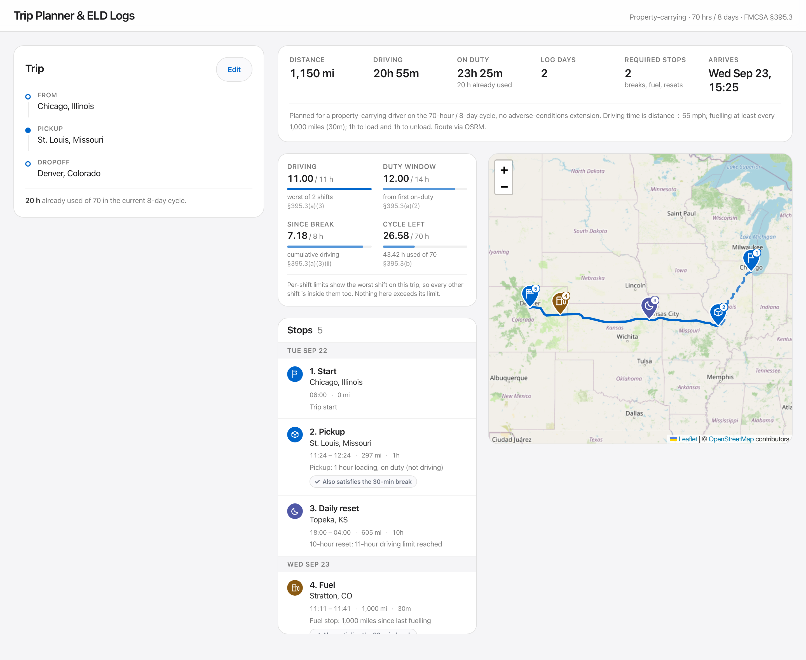
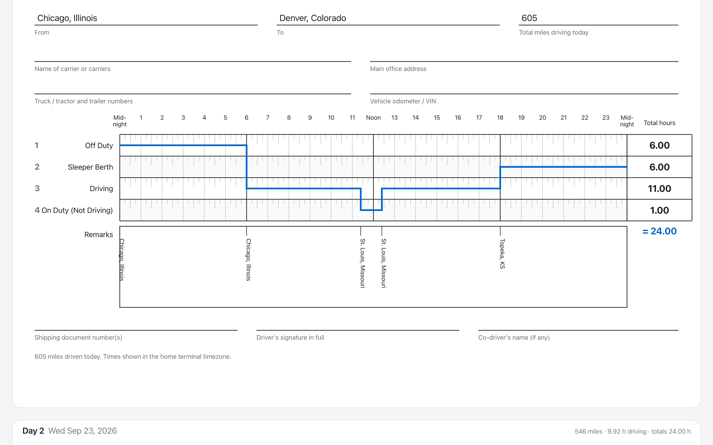

# Trip Planner & ELD Log Generator

[](https://github.com/Pinaki2046K/spotter-eld-planner/actions/workflows/ci.yml)

Give it a start point, a pickup, a dropoff and the hours already used in the current 8-day
cycle. It returns a routed map, every stop the Hours of Service rules force you to make, and
one drawn FMCSA driver's daily log per calendar day.

**Live demo:** <https://spotter-eld-planner-phi.vercel.app>
**API:** <https://spotter-eld-api-9iqz.onrender.com> (`/api/health/`, `/api/trips/{uuid}/`)

**See it work without typing:** press *Load example trip*, or open the seeded trip directly at
<https://spotter-eld-planner-phi.vercel.app/?trip=11111111-2222-4333-8444-555555555555> —
Chicago → St. Louis → Denver with 20 cycle hours used.

> The API is on Render's free tier and sleeps after 15 minutes idle, so the first request after a
> quiet spell takes roughly 50 seconds while the instance boots. Everything after that is fast.





## Run it locally

```bash
git clone <this repo> && cd spotter
(cd backend && python3 -m venv .venv && .venv/bin/pip install -r requirements-dev.txt && .venv/bin/python manage.py migrate && .venv/bin/python manage.py seed_example_trip)
(cd backend && .venv/bin/python manage.py runserver) &
(cd frontend && npm install && npm run dev)
```

Open <http://localhost:5173>. No API keys and no database setup: it falls back to SQLite and
to the public OSRM router. Vite proxies `/api` to Django, so there is no CORS to configure.

```bash
cd backend  && .venv/bin/python -m pytest -q   # 72 tests, engine + API
cd frontend && npm run test -- --run           # 33 tests, formatting + components
```

## How it works

```
Browser ──HTTPS /api──▶ Django + DRF ──▶ Nominatim (geocode, cached)
   │                         │         └▶ OpenRouteService ──fallback──▶ OSRM
   │                         ▼
   │                   HOS engine (pure Python)
   │                         ▼
   └◀────── JSON ─────  Postgres (trip, legs, stops, log days, duty entries)
```

`backend/hos/` is the product; everything else renders its output. It is a pure Python package
with **no Django imports**, no network access and no wall-clock reads, so it can be unit-tested
in isolation and returns byte-identical output for identical inputs.

The planner walks the route consuming driving time. On each iteration it computes how many
minutes remain until each constraint binds — the 11-hour driving limit, the 14-hour window, the
30-minute break, the next fuel stop, the 70-hour cycle, the next waypoint — drives exactly the
smallest of those, and emits the event that constraint demands. Every event carries a `reason`
string ("10-hour reset: 11-hour driving limit reached") which surfaces on the map marker and in
the stop list, so the schedule can be audited without reading the code.

A second pass splits the continuous timeline at local midnight into `LogDay`s. The invariant,
asserted in code and in tests: **every log day's four status totals sum to exactly 24.00 hours.**
That single assertion catches nearly every scheduling bug, and the totals column on each sheet is
its visible proof.

All arithmetic is in whole minutes. That is what makes the totals come out at 24.00 rather than
23.999999, and it removes a class of float-drift bugs from the grid geometry.

### The rules implemented

| Rule | Limit | Reset | CFR |
| --- | --- | --- | --- |
| Driving limit | 11 hours driving | 10 consecutive hours off | §395.3(a)(3) |
| Driving window | 14 consecutive hours from first on-duty | 10 consecutive hours off | §395.3(a)(2) |
| Rest break | 30 consecutive minutes after 8 **cumulative** driving hours | any 30-minute non-driving period | §395.3(a)(3)(ii) |
| Cycle limit | 70 on-duty hours in 8 days | 34 consecutive hours off | §395.3(b) |
| Fuelling | at least every 1,000 miles | — | brief |

Two details that are commonly got wrong, and are tested explicitly:

- The 14-hour window opens at the **first on-duty activity** of the shift, not the first driving
  minute, and breaks do not extend it. A shift that starts with an hour of loading has 13 hours
  left to finish driving in.
- The 30-minute break is due after 8 **cumulative** driving hours, not 8 consecutive, and it may
  be taken off duty, on duty not driving, or in the sleeper berth. So the 1-hour pickup and the
  30-minute fuel stop both satisfy it when it falls due — which is why a compliant day often has
  no separate break stop.

## Assumptions

Fixed by the brief, and surfaced in the UI so you can see they were honoured:

| Assumption | Value | Where |
| --- | --- | --- |
| Driver type | Property-carrying, 70 hrs / 8 days | `HOSConfig.CYCLE_HOURS = 70` |
| Adverse driving conditions | None | no 2-hour extension logic exists |
| Fuelling interval | at least every 1,000 miles | `HOSConfig.FUEL_INTERVAL_MILES = 1000` |
| Pickup | 1 hour, on duty not driving | `HOSConfig.PICKUP_HOURS = 1` |
| Dropoff | 1 hour, on duty not driving | `HOSConfig.DROPOFF_HOURS = 1` |

Mine, not the brief's:

- **Average truck speed 55 mph.** Routing APIs return car durations. Distance comes from the API;
  driving time is `distance / 55`. Defensible, and it removes a class of accuracy complaints.
- **Fuel stop duration 30 minutes**, on duty not driving. The brief gives the frequency but not
  the duration. 30 minutes is chosen because it also satisfies the 30-minute break requirement
  when that falls due.
- **The 70-hour cycle is tracked as a running total from the hours you enter, reset only by a
  34-hour restart** — not as a true rolling 8-day window. A single number cannot say how the
  prior hours were distributed across the previous eight days, and treating them as one block is
  the conservative reading: the planner never schedules a trip that a rolling window would forbid.
- **Intermediate stop names come from an offline gazetteer** of ~30,000 US places that ships with
  the engine (`backend/hos/data/`), not from reverse geocoding. One Nominatim round trip per stop
  against a 1 req/sec limit would blow the 10-second budget on its own; this is ~0.1 ms per lookup
  and keeps the engine offline and deterministic.
- **Log days are midnight-to-midnight in the departure timezone**, which is treated as the home
  terminal timezone. The offset is persisted on the trip, because Django stores every datetime in
  UTC and a log sheet drawn in UTC would put a Chicago driver's midnight at 19:00.

## Deliberately out of scope

Each of these is a decision, not an omission:

- **Split sleeper berth (§395.1(g)).** The 7+3 and 8+2 pairings are legal but add a large
  branching factor to the planner for no gain in output accuracy.
- Short-haul exceptions, the 16-hour exception, the adverse-conditions exception.
- Multi-driver teams and passenger-seat time.
- User accounts, authentication, per-user saved history. Trips are shareable by unguessable UUID
  instead.
- Real ELD hardware integration or FMCSA submission.
- Live traffic, weather, road restrictions, HAZMAT routing.

## Design

The visual language is the Apple spec in `frontend/DESIGN.md` (`npx getdesign@latest add apple`),
applied by hand with Tailwind — it is a specification, not a component library, so every component
here is written from scratch against its tokens. One accent colour (Action Blue `#0066cc`), the
400/600/700 weight ladder with 500 absent, pill CTAs, hairlines and surface-colour changes instead
of shadows.

**One deliberate reading of the single-accent rule.** It governs chrome, not data encoding. Duty
statuses and stop types need to be distinguishable on the grid, the markers and the stop list, so
they get a restrained functional palette of four muted tones at comparable saturation. Every one
of them is *also* carried by an icon and a text label, so nothing depends on colour alone, and all
four clear 4.5:1 on white.

Log sheets are **inline SVG**, not canvas and not an overlay on the supplied PNG: coordinates are
computed from grid constants rather than eyeballed against a raster, the sheet stays sharp at any
zoom, and it exports straight to a vector PDF. The one concession is that the SVG uses literal hex
colours rather than CSS variables — `svg2pdf.js` resolves paint attributes itself and never runs
the cascade, so a variable would export as black (`frontend/src/lib/colors.ts`).

Accessibility floor: keyboard-navigable form with an ARIA combobox for autocomplete, visible focus
rings, 4.5:1 text contrast, an `aria-label` on every map marker, and the stop list as the
non-visual equivalent of the map.

## API

JSON only, no authentication.

| Method | Path | Purpose |
| --- | --- | --- |
| `GET` | `/api/geocode/?q=` | Autocomplete proxy to Nominatim, throttled and cached |
| `POST` | `/api/trips/` | Geocode, route, plan, persist, return the whole trip |
| `GET` | `/api/trips/{uuid}/` | Retrieve a persisted trip, for shareable URLs |
| `GET` | `/api/health/` | Liveness probe, used to keep the free dyno warm |

Every 4xx and 5xx uses one envelope so the frontend can say something specific rather than showing
a generic failure toast:

```json
{ "error": { "code": "OUT_OF_COUNTRY", "message": "…", "field": "pickup_location" } }
```

Codes: `GEOCODE_NOT_FOUND`, `OUT_OF_COUNTRY`, `NO_ROUTE`, `INVALID_CYCLE_HOURS`,
`UPSTREAM_TIMEOUT`, `CYCLE_EXHAUSTED`, `INVALID_INPUT`, `NOT_FOUND`, `INTERNAL`.

Every upstream call has an 8-second timeout and one backed-off retry. Routing tries
OpenRouteService first and falls back to the public OSRM demo server, which needs no key, so the
demo keeps working when one provider has a bad day. All third-party keys stay server-side — the
browser never calls Nominatim or OpenRouteService directly.

## Stack

Django 5 + DRF, PostgreSQL in production and SQLite locally, a pure-Python HOS engine, React 19 +
Vite + TypeScript, Tailwind, `react-leaflet` with OpenStreetMap tiles (no key, no quota),
`jsPDF` + `svg2pdf.js` for client-side export, pytest and Vitest.

## Deployment

Vercel hosts the React build; Render hosts Django and Postgres, declared as a Blueprint in
`render.yaml` at the repo root. Create it from the Render dashboard with **New → Blueprint** and
point it at this repo — the web service, the Postgres instance and the generated `SECRET_KEY` all
come from that file.

Railway would have been the better fit — no forced sleep — but its free trial no longer covers a
new project, so this runs on Render's free tier instead. `backend/fly.toml` remains as a fallback
with `min_machines_running = 1` if a warm process becomes worth the setup.

**The free tier's tradeoff, stated plainly:** the web service spins down after 15 minutes idle, so
a cold visit pays roughly a 50-second start while the instance boots and migrations run. There is
deliberately no uptime pinger in the repo — the 750 free instance-hours are shared across the
whole Render workspace, so pinging `/api/health/` every 5 minutes is switched on by hand for the
review window rather than burning hours continuously. The frontend still fires a health ping on
page load, so the backend is warming while an address is being typed.

`ALLOWED_HOSTS` needs no configuration: Django trusts `.onrender.com` plus the injected
`RENDER_EXTERNAL_HOSTNAME`, and derives `CSRF_TRUSTED_ORIGINS` from them. Two variables are marked
`sync: false` in the Blueprint and set in the dashboard after the first deploy —
`CORS_ALLOWED_ORIGINS` (the exact Vercel production origin, never `*`) and the optional
`ORS_API_KEY`. Without the key, routing falls back to the public OSRM demo server. Frontend:
`VITE_API_BASE_URL`. See `backend/.env.example` and `frontend/.env.example`.

Render's free Postgres is deleted after 30 days, which is fine for a review window but means the
demo is not a durable store.

## Repository

```
backend/
  hos/          the engine: config, planner, midnight split, gazetteer. No Django.
  trips/        models, DRF serializers, views, geocoding and routing clients, caching
  tests/        invariants.py holds the eight assertions every scenario test runs
frontend/
  src/lib/      formatting, duty metadata, PDF export
  src/components/  form, map, stop list, log sheet SVG
  DESIGN.md     the design specification the UI is built against
```
